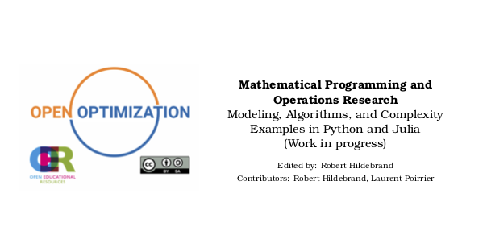

# Mathematical Programming and Operations Research
## Modeling, Algorithms, and Complexity with Examples in Python and Julia
Edited by: Robert Hildebrand

The current release of this book can be found at [here](https://github.com/open-optimization/open-optimization-or-book/releases/download/v0.0.7/open-optimization.pdf).

This book was desigend originally for the undergraduete course ISE 3434 - "Deterministic Operations Research II" taught at Virginia Tech.  I will cover topics in linear programming, integer programming, and nonlinear programming along with basic understanding of complexity theory, many code examples, and various methods of solving problems.

### Topics to be worked on: 
- Throughout the book, it needs more examples, figures, and associated code.   
- Needs several sections on Linear Optimization (modeling, algorithms, and polyhedral theory)
- Needs more topics on heuristics (genetic algorithms, particle swarm optimization, tabu search, etc.)
- Editing, rewriting, and improving content.
- Properly formatted citations of resued material.

You are encouraged to write and contribute to this endeavor by adding content to the Open Optimization organization, or by making pull requests directly to this repository.  Please contact Robert Hildebrand [rhl@vt.edu](rhil@vt.edu) if you would like to take a larger role in this production.

# Open Optimization
This is part of the Open Optimization project - an ecosystem for open-source materials for teaching optimization and operations research.  This ecosystem is being formed to host open-source lecture notes, lecture slides, examples, code, figures, and textbooks on material and courses related to optimization.

All material other than code will be licensed under Creative Commons Attribution-ShareAlike 4.0 International (CC BY-SA 4.0) that permits free reuse and alteration of the material provided the proper attribution is given.  All material posted will be not just open-source, but open-source code as well - including LaTeX, tikz, and other means of generating content.  This allows those interested in reusing material an easy way to change and adapt the material as needed.

All code (e.g., Julia, Python, AMPL, GAMS, MatLab, etc.) on this repository will be licensed freely under the MIT License.  This is in an effort to make code simple and easy to reuse.

[More information about the Open Optimization project and how you can contribute](https://github.com/open-optimization/open-optimization-common/blob/master/README.md)
