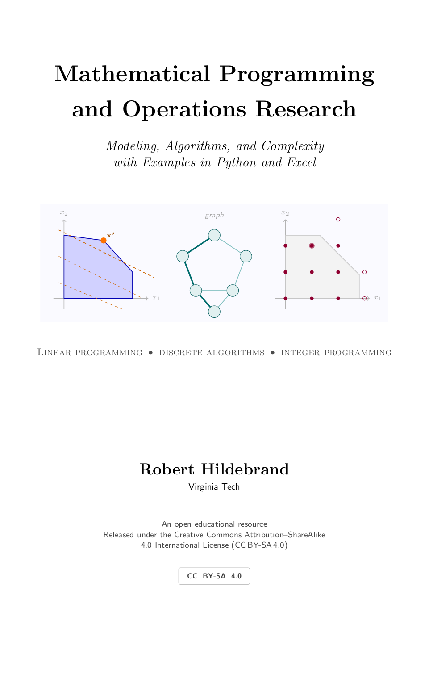

# Mathematical Programming and Operations Research

## Book 1: Linear and Integer Programming — Modeling, Algorithms, and Complexity, with Examples in Python and Excel

Edited by Robert Hildebrand

## 📖 The first complete draft is available now!

Read or download the book at the project site:

**https://open-optimization.github.io/open-optimization-or-book/**

- [Read online (EPUB reader)](https://open-optimization.github.io/open-optimization-or-book/read/)
- [HTML edition](https://open-optimization.github.io/open-optimization-or-book/html/)
- [Download the PDF](https://open-optimization.github.io/open-optimization-or-book/Intro-Math-Programming/baseText/book/book1-main.pdf)
- [Download the EPUB](https://open-optimization.github.io/open-optimization-or-book/epub-build/book1-epub.epub)
- [Interactive visualizations](https://open-optimization.github.io/open-optimization-or-book/visualizations/)

## About the book

An open textbook on linear programming, discrete algorithms, and integer
programming, with worked examples in Excel and Python (Gurobi), graded
exercise ladders with selected solutions, real-world case studies, and
interactive visualizations. It was designed for the undergraduate courses
ISE 2404/3434 — Deterministic Operations Research — at Virginia Tech and is
being prepared for publication with Virginia Tech Publishing & Press.

Feedback is welcome! Please open an issue on this repository or contact
Robert Hildebrand at [rhil@vt.edu](mailto:rhil@vt.edu) if you find errors or
would like to contribute to future editions or to Book 2 (Nonlinear and
Advanced Optimization, in progress).

## Open Optimization

This book is part of the [Open Optimization](https://github.com/open-optimization)
project — an ecosystem of open-source materials for teaching optimization
and operations research: lecture notes, slides, examples, code, figures, and
textbooks. All source material (LaTeX, TikZ, figures) is available in this
repository so the book is easy to adapt and reuse.

## Licenses

- **Text and figures:** [Creative Commons Attribution-ShareAlike 4.0 International (CC BY-SA 4.0)](https://creativecommons.org/licenses/by-sa/4.0/) — free to reuse, adapt, and share with attribution.
- **Code** (Python, Excel models, build tooling): [MIT License](https://opensource.org/licenses/MIT).

[More about the Open Optimization project and how to contribute](https://github.com/open-optimization/open-optimization-common/blob/master/README.md)
